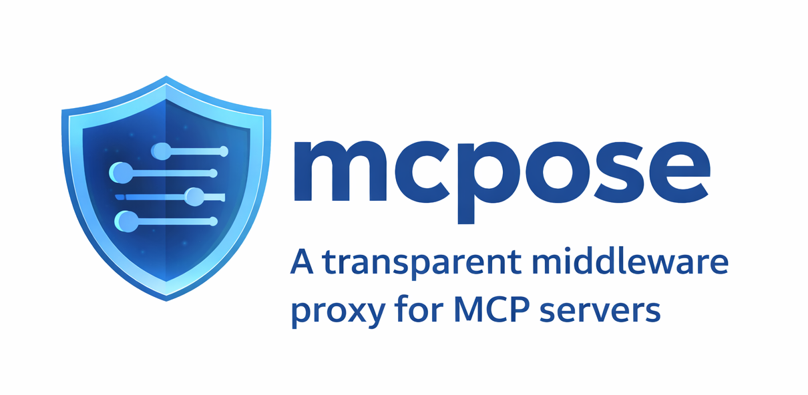

<p align="center">
  
</p>

# mcpose

[](https://www.npmjs.com/package/mcpose)
[](./LICENSE)
[](https://nodejs.org/)
[](https://www.typescriptlang.org/)
[](https://github.com/amir-gorji/mcpose/actions/workflows/ci.yml)

**The audit and governance layer for MCP.**

mcpose is a transparent middleware proxy for MCP servers.
It sits between an LLM client and an upstream server, routing every tool, resource, and `list_tools` call through composable middleware you control.
The client sees a normal MCP server; the upstream sees a normal MCP client; neither has to change.

```
┌──────────────┐        ┌────────────────────────────────┐        ┌────────────────────┐
│  LLM client  │ ◄────► │  mcpose                        │ ◄────► │  Upstream MCP      │
│  (Claude,    │        │  · identity resolution         │        │  server            │
│   Cursor…)   │        │  · visibility filters          │        │  (stdio or HTTP)   │
└──────────────┘        │  · middleware pipelines        │        └────────────────────┘
                        │  · audit trail                 │
                        └────────────────────────────────┘
```

Add [`@mcpose/audit`](./packages/audit/README.md) and every call through that pipeline also becomes a tamper-evident audit record: HMAC-chained, Merkle-anchored, and signed, for evidence that stands up under DORA Article 17 and SR 11-7 review.

## Table of Contents

- [Features](#features)
- [Who this is for](#who-this-is-for)
- [How it compares](#how-it-compares)
- [Packages](#packages)
- [Install](#install)
- [Quick start](#quick-start)
- [How it works](#how-it-works)
  - [Routing: hidden, pass-through, middleware](#routing-hidden-pass-through-middleware)
  - [The middleware onion](#the-middleware-onion)
  - [Array order: the one surprising rule](#array-order-the-one-surprising-rule)
  - [What the proxy preserves](#what-the-proxy-preserves)
- [Guides](#guides)
  - [PII redaction with audit](#pii-redaction-with-audit)
  - [Rewriting list_tools](#rewriting-list_tools)
- [Examples](#examples)
- [API reference](#api-reference)
- [Tamper-evidence: what is and is not guaranteed](#tamper-evidence-what-is-and-is-not-guaranteed)
- [Background](#background)
- [Roadmap](#roadmap)
- [Contributing](#contributing)
- [Security](#security)
- [License](#license)

---

## Features

- **Transparent proxy.** Wrap any upstream MCP server without modifying it, over stdio or HTTP/SSE.
- **Composable middleware** with a predictable onion model: each layer runs before *and* after the layers inside it.
- **Hide or gate tools and resources** per caller, with a structured `RejectionReason` on every blocked call instead of an opaque error.
- **Resolve caller identity once per session**, then read the same `Identity` from every request in that session.
- **Tamper-evident audit trails** via [`@mcpose/audit`](./packages/audit/README.md): HMAC-chained events covering tool *and* prompt calls, a signed Merkle `ReplayManifest`, and AES-256-GCM encryption for high-sensitivity payloads.
- **Prove it in CI** with [`@mcpose/testing`](./packages/testing/README.md): runner-agnostic assertions that a trail is intact, redacted, and internally consistent.
- **Production-minded.** Native ESM, first-class TypeScript types, Node.js 20+, no runtime dependencies beyond the MCP SDK.

## Who this is for

Reach for mcpose when:

- You operate MCP servers in a regulated environment (finance, healthcare) and need PII redaction, caller identity, and a defensible audit trail on every tool call.
- You need cross-cutting behavior (logging, redaction, rate limiting, governance) on an MCP server you do not own or cannot modify.
- You need to hide or gate specific tools and resources per caller, and to record what was blocked as well as what ran.

Look elsewhere when:

- You control the single MCP server and need one hook in one place.
  A request handler in your own server is less machinery than a proxy hop.
- Your requirement is purely transport-level: TLS termination, IP allowlists, or rate limiting by source address.
  An HTTP gateway already does that, and mcpose does not replace it.
- You need the audit trail to re-execute historical calls.
  A `ReplayManifest` proves *what happened*; session re-execution is v4 work.

## How it compares

mcpose composes with the tools below far more often than it replaces them.
Versions noted where they matter: mcpose 2.2.0, `@mcpose/audit` 3.0.0.

| If you are currently | It works well when | Where it runs out |
|---|---|---|
| **Writing the concern into each MCP server** | You have one server, one team, and the concern is a few lines of logging. | Every new server re-implements redaction and audit. The logic is not independently testable, and it ships on the server's release cycle. |
| **Putting an HTTP gateway in front of the MCP endpoint** (Envoy, Kong, nginx) | You need TLS, IP policy, or coarse rate limits. Gateways are excellent at this. | A gateway sees a JSON-RPC body, not a tool call. It cannot filter `list_tools`, reject `transfer_funds` for one role, or hash a tool's arguments into an audit chain without parsing MCP itself. |
| **The MCP SDK's own request handlers** | You own the server and want one hook with zero extra hops. | Handlers are per-server and do not compose. There is no shared onion, no `passThroughTools` escape hatch, and no cross-server identity or audit story. |
| **A log pipeline (OpenTelemetry, Splunk, ELK)** | You need observability: latency, error rates, volume. mcpose feeds these through `onTelemetry`. | Logs are mutable and unordered by design. They answer "what did we observe"; a regulator asks "prove this record was not altered", which needs the HMAC chain and the signed manifest. |

The honest summary: if you need observability, use a log pipeline, and let mcpose feed it.
If you need *evidence*, you need the chain and the manifest, and that is what `@mcpose/audit` adds.

## Packages

This is a monorepo.
Each package publishes independently and carries its own README on npm.

| Package | Version | Stability | What it does |
|---|---|---|---|
| [`mcpose`](./packages/core/README.md) | [](https://www.npmjs.com/package/mcpose) | Stable | Proxy core: middleware pipeline, stdio and HTTP transports, identity, governance. |
| [`@mcpose/audit`](./packages/audit/README.md) | [](https://www.npmjs.com/package/@mcpose/audit) | Stable | Tamper-evident HMAC audit chain and signed Merkle `ReplayManifest`. |
| [`@mcpose/testing`](./packages/testing/README.md) | [](https://www.npmjs.com/package/@mcpose/testing) | Stable | Runner-agnostic compliance assertions over an audit trail. |

`@mcpose/policy`, `@mcpose/fintech-identity`, and `@mcpose/otel` appear in the [roadmap](#roadmap) and do not exist yet.

## Install

**Prerequisites**

- Node.js 20 or newer.
- `@modelcontextprotocol/sdk` `^1.17.0`, a peer dependency you install yourself.

```bash
npm install mcpose @modelcontextprotocol/sdk
```

For tamper-evident audit trails, add the audit package and its test-time assertions:

```bash
npm install @mcpose/audit
npm install --save-dev @mcpose/testing
```

## Quick start

Connect to an upstream over stdio, add one middleware, and serve:

```ts
import { createBackendClient, startProxy } from 'mcpose';
import type { ToolMiddleware } from 'mcpose';

// 1. Connect to the upstream MCP server.
const backend = await createBackendClient({
  command: 'node',
  args: ['/path/to/backend-server.mjs'],
});

// 2. Define middleware: (req, next, ctx) => Promise<result>
const loggingMW: ToolMiddleware = async (req, next) => {
  console.error(`→ ${req.params.name}`);
  const result = await next(req);
  console.error(`← ${req.params.name} done`);
  return result;
};

// 3. Serve the proxy over stdio.
await startProxy(backend, { toolMiddleware: [loggingMW] });
```

Point your MCP client at this process instead of the upstream, and every tool call now flows through `loggingMW`.

To serve over HTTP/SSE instead, with per-session identity, mTLS, session limits, and reconnect replay, swap `startProxy` for [`startHttpProxy`](./packages/core/README.md#serving-over-httpsse).

### One endpoint over many upstreams

Pass a record of named backends instead of one client, and the same proxy governs all of them through one pipeline and one audit trail:

```ts
await startProxy(
  {
    crm: await createBackendClient({ url: 'https://crm.internal/mcp' }),
    docs: await createBackendClient({ command: 'node', args: ['./docs-server.mjs'] }),
  },
  { toolMiddleware: [loggingMW], hiddenTools: ['crm__delete_account'] },
);
```

The record keys are backend keys, and the client sees `crm__lookup`, `docs__search`, and so on.
Every option matches those namespaced names, an upstream that goes down degrades its own tools out of `tools/list` rather than failing it, and a call that carries no key that names a configured backend is rejected rather than guessed at.
See [mesh mode](./packages/core/README.md#many-upstreams-mesh-mode-backends) for the full behaviour, and [ADR-0013](./docs/adr/0013-multi-backend-composition.md) for why it works that way.

## How it works

### Routing: hidden, pass-through, middleware

For each tool or resource, mcpose picks exactly one path:

| Path | Option | Behavior |
|---|---|---|
| **Hidden** | `hiddenTools` / `hiddenResources` | Omitted from list responses, and rejected at call time with `TOOL_HIDDEN` / `RESOURCE_HIDDEN`. `hiddenTools` also takes a predicate, so a dispatcher (meta-tool) cannot reach a hidden tool by argument; see `dispatcherAwareBlock`. |
| **Pass-through** | `passThroughTools` / `passThroughResources` | Forwarded to the upstream untouched. Transforming middleware is skipped. |
| **Local** | `localTools` | Served by the proxy itself instead of the upstream, still through the full `toolMiddleware` pipeline. Hidden beats local; local beats an upstream tool of the same name; pass-through does not apply. |
| **Middleware** | everything else | Routed through the full `toolMiddleware` / `resourceMiddleware` pipeline. A `prompts/get` call runs the `promptMiddleware` pipeline the same way. |

Three consequences worth knowing up front:

- A hidden tool is rejected *inside* the pipeline, so observing middleware such as audit still records the attempt.
  The upstream is never called.
- A tool listed in both `hiddenTools` and `passThroughTools` stays hidden.
- Pass-through skips *transforming* middleware only.
  Middleware wrapped in `markPassThroughObserver()` still runs, which is how audit and telemetry keep full coverage.
  The middleware from `createAuditMiddleware` is wrapped for you.

Mesh mode adds no fifth path.
Choosing which upstream a call goes to happens *inside* the innermost `next` of whichever path above applies, so a mesh call runs exactly the pipeline a 1:1 call runs, audit included.
A name that resolves to no configured backend is rejected there too, with `BACKEND_UNROUTABLE`, so observing middleware records the attempt.
That holds for prompts as well: `prompts/get` runs `promptMiddleware`, and its unroutable-name rejection is thrown inside the pipeline, so audit sees prompt calls and prompt rejections ([ADR-0014](./docs/adr/0014-prompt-calls-run-a-pipeline-and-are-audited.md)).
Prompt hiding and prompt pass-through do not exist yet, because `prompts/list` has no pipeline.

### The middleware onion

Each middleware receives the request, a `next` function that invokes the rest of the pipeline, and a normalized `ProxyContext`.
Outer layers run code before *and* after the inner ones:

```
  request ──►
             ┌──────────────────────────────────────────┐
             │  outerMW  (enter)                        │
             │  ┌────────────────────────────────────┐  │
             │  │  innerMW  (enter)                  │  │
             │  │  ┌──────────────────────────────┐  │  │
             │  │  │  upstream call               │  │  │
             │  │  └──────────────────────────────┘  │  │
             │  │  innerMW  (exit) ◄── response      │  │
             │  └────────────────────────────────────┘  │
             │  outerMW  (exit) ◄── response            │
             └──────────────────────────────────────────┘
  ◄── response
```

### Array order: the one surprising rule

Middleware arrays in `ProxyOptions` are in **response-processing order**: the first element processes the response *first*, which makes it the innermost layer.
This is deliberate, because it is the ordering that makes the safety property obvious.
To guarantee audit never sees raw PII, put redaction first:

```ts
toolMiddleware: [piiMW, auditMW]
// Execution:
// 1. auditMW enter  → capture startTime         (outermost)
// 2. piiMW enter    → transform request
// 3. upstream call
// 4. piiMW exit     → redact PII from response  (processes response first)
// 5. auditMW exit   → log already-clean data    (processes response last)
```

Mapping array indices onto both traversal directions:

```
toolMiddleware: [ piiMW,  auditMW ]
                  index 0  index 1

request:   client ──► auditMW ──► piiMW ──► upstream   (last index first)
response:  upstream ──► piiMW ──► auditMW ──► client   (index 0 first)
```

The rule in one line: **the last element is outermost**.
The practical form: transformers first, observers last.

> **Getting the order backwards fails silently.**
> `[auditMW, piiMW]` puts audit innermost, so the audit store fills with unredacted payloads.
> The client still receives redacted data, so nothing looks wrong, and the failure surfaces only when someone reads the trail.
> No error is raised, and the configuration reads plausibly.

| Ordering | What audit records |
|---|---|
| `[piiMW, auditMW]` (safe) | The redacted response: PII never reaches the log. |
| `[auditMW, piiMW]` (unsafe) | The raw upstream response, unredacted, silently. |

`compose([outerMW, innerMW])` uses the **opposite**, outermost-first convention.
`ProxyOptions` arrays and `compose()` arguments are not interchangeable.
See [ADR-0002](./docs/adr/0002-proxy-options-array-response-processing-order.md) for why.

### What the proxy preserves

Transparency is a contract, not a slogan.
End to end, mcpose:

- mirrors the upstream's advertised capabilities,
- forwards abort signals to upstream tool, resource, and prompt calls,
- relays upstream progress updates back to the client,
- advertises and fans out list-changed notifications when the upstream supports them,
- forwards `prompts/list` as-is when the upstream supports prompts, and runs `prompts/get` through `promptMiddleware`,
- applies `hiddenTools` filtering both before *and* after `listToolsMiddleware`, so middleware cannot re-add a hidden tool.

One deliberate exception to transparency, in both directions: `params._meta` is stripped from every forwarded request, and top-level `_meta` from every upstream result, by default.
Clients put correlation identifiers in request `_meta` (`traceparent`, `vscode/conversationId`) and the upstream is frequently a third party; upstreams stamp their own into result `_meta` (the SDK stamps `io.modelcontextprotocol/related-task`) and the client is a third party to those.
Set `stripRequestMeta: false` / `stripResultMeta: false` to restore verbatim forwarding.
See [ADR-0008](./docs/adr/0008-strip-request-meta.md) and [ADR-0009](./docs/adr/0009-strip-result-meta.md).

## Guides

### PII redaction with audit

The origin use case: a financial-grade MCP server where every response must be scrubbed of PII before it reaches the LLM *or* the audit log.

```ts
import { mapToolResult, startHttpProxy } from 'mcpose';
import type { ToolMiddleware } from 'mcpose';
import {
  createAuditMiddleware,
  createDefaultSigningKeyProvider,
  createSensitivityResolver,
} from '@mcpose/audit';

// Supplied by your application: backend, auditLog, manifestStore, extractJwt.

function createPiiMiddleware(patterns: RegExp[]): ToolMiddleware {
  const scrub = (text: string) =>
    patterns.reduce((t, re) => t.replace(re, '[REDACTED]'), text);
  // mapToolResult requires a handler per payload channel (text blocks,
  // non-text blocks, structuredContent), so nothing slips through unmapped.
  return async (req, next) =>
    mapToolResult(await next(req), {
      onText: (block) => ({ ...block, text: scrub(block.text) }),
      onOther: () => null, // drop images/audio/resources we cannot scrub
      onStructured: (structured) =>
        JSON.parse(scrub(JSON.stringify(structured))),
    });
}

const auditHandle = createAuditMiddleware({
  signingKey: createDefaultSigningKeyProvider(process.env.AUDIT_SECRET!),
  sensitivityResolver: createSensitivityResolver({ search: 'medium', transfer: 'high' }),
  onEvent: (e) => auditLog.append(e),
  onManifest: (m) => manifestStore.save(m),
});

await startHttpProxy(
  backend,
  {
    toolMiddleware: [
      createPiiMiddleware([/\b\d{9}\b/g, /[A-Z]{2}\d{6}/g]), // redaction runs first
      auditHandle.middleware,                                // so audit records clean data
    ],
    // Prompt calls cross the same trust boundary, so audit them too.
    promptMiddleware: [auditHandle.promptMiddleware],
  },
  {
    resolveIdentity: extractJwt,
    onSessionClosed: (id) => auditHandle.closeSession(id),
  },
);
```

Because of the [array order rule](#array-order-the-one-surprising-rule), PII is redacted before the audit layer ever sees the response, so no raw PII reaches a log.

> **Reference implementation:** [`elastic-pii-proxy`](https://github.com/amir-gorji/elastic-pii-proxy) runs this pattern in production, proxying Elasticsearch to LLM agents over mcpose with redaction and `@mcpose/audit`.

### Rewriting list_tools

Reshape the tool catalog the client sees without touching the upstream:

```ts
import type { ListToolsMiddleware } from 'mcpose';

const enrichDescriptions: ListToolsMiddleware = async (req, next) => {
  const result = await next(req);
  return {
    ...result,
    tools: result.tools.map((tool) =>
      tool.name === 'wire_transfer'
        ? { ...tool, description: `${tool.description ?? ''} (approval required)` }
        : tool,
    ),
  };
};
```

`hiddenTools` stays authoritative: filtering is applied after this middleware too, so it cannot re-add a hidden tool.

For the common security case, the shipped `sanitizeToolDescriptions()` middleware strips URLs and configured patterns from tool and schema descriptions, because the catalog is an egress channel into model context ([ADR-0010](./docs/adr/0010-tool-catalog-egress-sanitizer.md)):

```ts
listToolsMiddleware: [sanitizeToolDescriptions({ patterns: ['acme-corp'] })],
```

Place it last in the array so it sanitizes the output of other list middleware and local tools.

## Examples

Runnable, commented examples live in [`examples/`](./examples/).

| Example | What it shows | Needs an upstream? |
|---|---|---|
| [`governance-proxy.ts`](./examples/governance-proxy.ts) | `hiddenTools`, `passThroughTools`, and `onTelemetry`, against a mock backend. | No |
| [`pii-redaction-audit.ts`](./examples/pii-redaction-audit.ts) | The canonical pattern: redaction composed with audit over HTTP/SSE, with per-session identity. | Yes |
| [`oauth-upstream-client.ts`](./examples/oauth-upstream-client.ts) | Connecting to an OAuth-protected upstream: dynamic registration, PKCE, persisted tokens with refresh. | Yes, OAuth-capable |

Start with `governance-proxy`, which is self-contained:

```bash
pnpm install
pnpm --filter mcpose-examples governance-proxy
```

See the [examples README](./examples/README.md) for the full run matrix.

## API reference

Each package's README is the canonical reference for its own exports, and each is self-contained:

| Package | Reference covers |
|---|---|
| [`mcpose`](./packages/core/README.md#api-surface) | `createBackendClient`, `startProxy`, `startHttpProxy`, `createProxyServer`, `compose`, `markPassThroughObserver`, `rejectionMcpError`, `createProxyContext`, `createInMemoryEventStore`, `hasToolContent`, `mapToolResult`, `dispatcherAwareBlock`, and the `ProxyContext` / `Identity` / `Backends` / `ProxyOptions` / `HttpProxyOptions` / `LocalTool` / `HiddenToolPredicate` / `RejectionReason` types, plus the `ToolMiddleware` / `ResourceMiddleware` / `PromptMiddleware` / `ListToolsMiddleware` middleware types. |
| [`@mcpose/audit`](./packages/audit/README.md#api-surface) | `createAuditMiddleware` (returning `middleware`, `promptMiddleware`, and `closeSession`), `createSensitivityResolver`, `createDefaultSigningKeyProvider`, `verifyAuditChain`, `verifyManifestSignature`, the Merkle helpers, the canonical serializers, and the `AuditEvent` / `ReplayManifest` / `AuditOptions` schemas. |
| [`@mcpose/testing`](./packages/testing/README.md#api) | `assertAuditChainIntegrity`, `assertReplayManifestValid`, `assertPiiRedacted`, `assertDelegationHonored`, each with what it does and does not prove. |

Test helpers for the proxy itself (`createMockBackendClient`, `runToolMiddleware`, `runListToolsMiddleware`, `runResourceMiddleware`) ship in the core package under the `mcpose/testing` subpath.
That is a different thing from the `@mcpose/testing` package, which asserts audit chains.
See [the core README](./packages/core/README.md#test-helpers-mcposetesting) for the distinction.

Vocabulary used across all of these is defined once in [`CONTEXT.md`](./CONTEXT.md).

## Tamper-evidence: what is and is not guaranteed

The value of an audit trail is what it can prove to someone who does not trust you, so the boundaries matter more than the feature list.

**With the signing secret**, `verifyAuditChain(events, signingKey)` recomputes every chain hash and `verifyManifestSignature(manifest, signingKey)` checks the manifest signature.
Together these detect insertion, deletion, reordering, and modification anywhere in the trail.
The signature covers the canonical serialization of the *entire* manifest, not just the Merkle root, so no field is silently swappable.

**Without the signing secret**, the assertions in `@mcpose/testing` prove internal consistency only.
They catch reordering, renumbering, duplication, head or middle deletion, and a swapped Merkle root.
They do **not** prove authenticity: a forger who rewrites every event and regenerates the root and proofs produces a document they accept, and needs no secret to do it.
Tail truncation also leaves a valid prefix, so `assertAuditChainIntegrity` alone accepts it; the manifest's `eventCount` is what catches that.

Two more boundaries worth stating plainly:

- The chain binds payloads through `inputHash` / `outputHash`, and does not cover `sensitivityTier`.
  Post-hoc tampering with the tier alone is not chain-detectable.
- Chaining requires a session id.
  Over stdio there is no session, so every event carries position 0 and no manifest is produced.

The reasoning behind the key hierarchy is in [ADR-0003](./docs/adr/0003-audit-subkeys-derived-from-signing-oracle.md), and the canonical-serialization format in [ADR-0004](./docs/adr/0004-audit-format-v2-canonical-serialization.md).
`@mcpose/audit` 3.0.0 writes audit format v2, a breaking change: archives written by a 2.x release verify only under a pinned 2.x.

## Background

mcpose was extracted from [`financial-elastic-mcp-server`](https://github.com/amir-gorji/financial-elastic-mcp-server), an Elasticsearch MCP server built for financial institutions that needed PII redaction and audit logging on every tool call.
Those concerns started life hardcoded into one server.
mcpose lifts the pattern into a reusable middleware layer that can wrap **any** upstream MCP server.

Release history lives in [`CHANGELOG.md`](./CHANGELOG.md).

## Roadmap

Shipped:

- [x] Composable middleware: `startProxy()`, `startHttpProxy()`, `createProxyServer()`
- [x] Streamable HTTP transport with stateful sessions and SSE reconnect replay
- [x] Identity resolution: the `resolveIdentity` hook, with `Identity` on every `ProxyContext`
- [x] mTLS through `tlsOptions` on `HttpProxyOptions`
- [x] `@mcpose/audit`: HMAC chain, Merkle proofs, signed `ReplayManifest`, sensitivity tiers
- [x] `@mcpose/testing`: compliance assertions
- [x] Multi-backend composition: one governed endpoint over many upstreams, with namespaced tools

Planned for v3:

- [ ] `@mcpose/policy`: RBAC policy engine
- [ ] `@mcpose/fintech-identity`: OIDC to financial identity profile
- [ ] `@mcpose/otel`: OpenTelemetry span adapter for `onTelemetry`
- [ ] Persistent `EventStore` adapters for Redis and Postgres
- [ ] A delegation header spec, so core can populate `delegatedFrom` itself
- [ ] GDPR/CCPA consent middleware with cryptographic erasure

Session re-execution from a `ReplayManifest` is v4.

## Contributing

Contributions are welcome.
[`CONTRIBUTING.md`](./CONTRIBUTING.md) covers the development setup, the common `pnpm` commands, and the conventions around `CONTEXT.md` and the ADRs.

Three rules carry more weight than the rest:

- Read [ADR-0003](./docs/adr/0003-audit-subkeys-derived-from-signing-oracle.md) and [ADR-0004](./docs/adr/0004-audit-format-v2-canonical-serialization.md) before touching the chain, key derivation, encryption, or `ReplayManifest`.
  These invariants fail silently: a change can compile, pass tests, and still void the guarantee.
- Run `pnpm ts:ci` and `pnpm test` before opening a pull request.
- Never weaken an existing audit assertion to make a test pass.

By participating you agree to uphold the [Code of Conduct](./CODE_OF_CONDUCT.md).

## Security

Report vulnerabilities privately by following [`SECURITY.md`](./SECURITY.md).
Do not open a public issue for a security report.

## License

MIT © Amir Gorji
